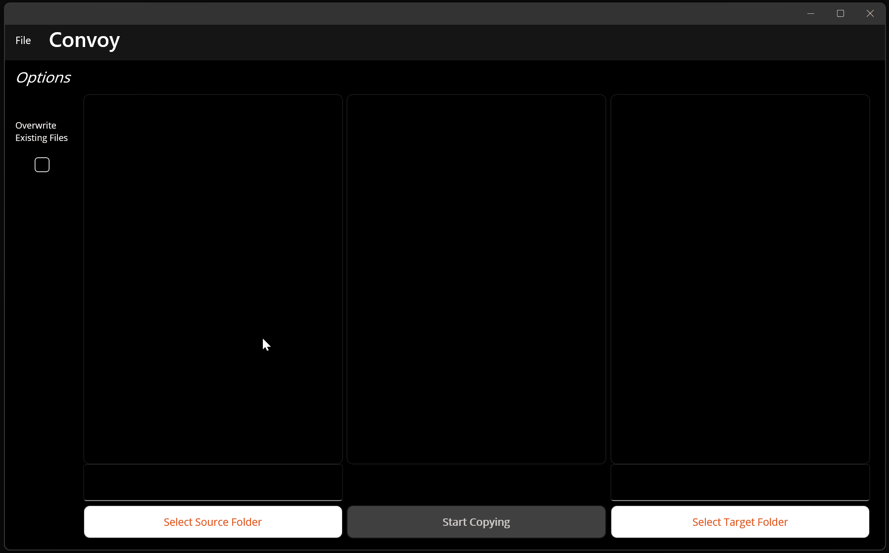

# Convoy

A cross platform desktop application for copying many large files across folders. It can compare the source and target directories and provide an audit of which files exist in source but not the target.

## Why?
I found that when copying a directory containing thousands of files ranging from 1kb to 200gb to a network drive over WiFi, files were occasionally and silently dropped. This happened most often when using Finder on Mac. So, I needed a simple application to accomplish the following:
- Select source and target folders and immediately see the number of files *including those in subdirectories* in each.
- Audit both folders to display the items that exist in source but not in target.
- Default to skipping files that already exist in target so that the copy task can be retried safely and repeatedly on a spotty network. But do allow the user to overwrite if desired.
- Keep track of any failed copies and make these available to be retried.
- Allow the user to safely cancel the copying task and add the copies-in-process to the failed queue.

## Shouldn't this have been a Python app?
Probably. I wanted to learn C# and .NET MAUI for the potential of mobile development and this was a real problem I wanted to solve.

In the end, I discovered [Commander One](https://apps.apple.com/us/app/commander-one-file-manager/id1035236694?mt=12) for Mac, which seems to be the best solution to the issue of Finder dropping files silently. I never experienced the problem repeatedly with File Explorer on Windows 11.
